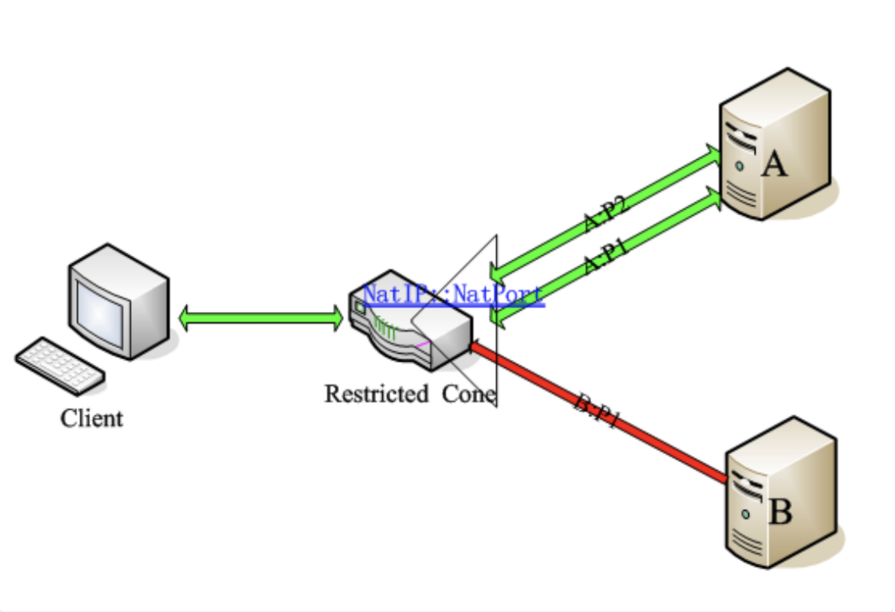
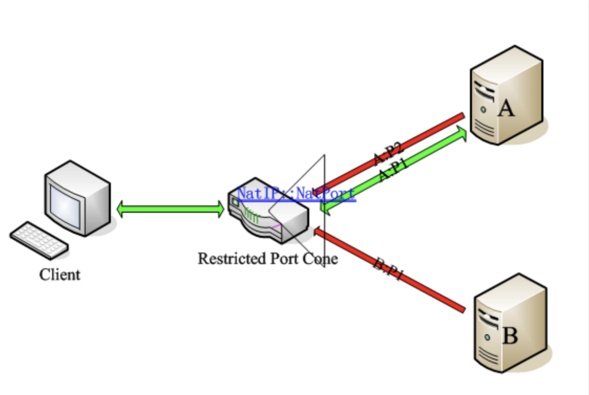
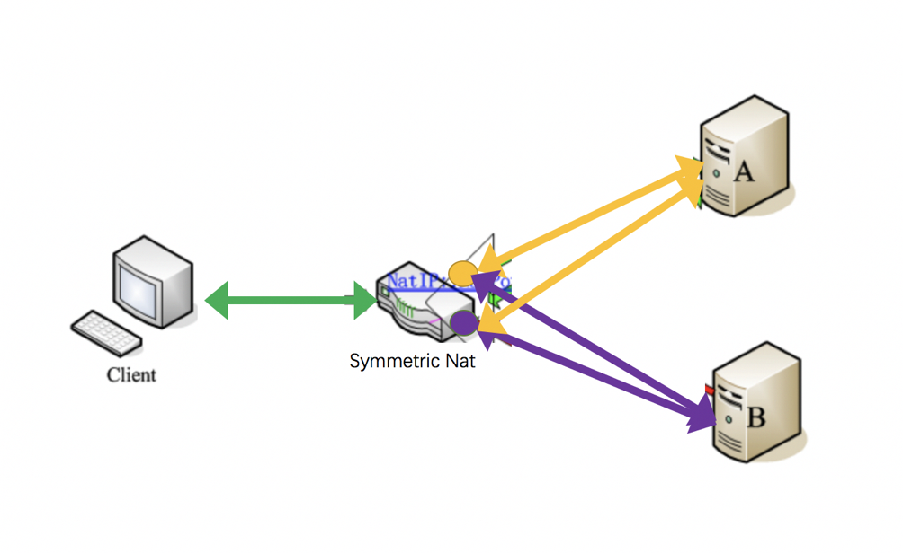

# NAT类型介绍

原文：https://cloud.tencent.com/developer/article/1005974

## 1）完全锥型NAT（Full Cone NAT，后面简称FC）

特点：IP和端口都不受限。

表现形式：将来自内部同一个IP地址同一个端口号（IP_IN_A : PORT_IN_A）的主机监听/请求，映射到公网IP某个端口（IP_OUT_B : PORT_OUT_B）的监听。任意外部IP地址与端口对其自己公网的IP这个映射后的端口访问（IP_OUT_B : PORT_OUT_B），都将重新定位到内部这个主机（IP_IN_A : PORT_IN_A）。该技术中，基于C/S架构的应用可以在任何一端发起连接。是不是很绕啊。再简单一点的说，就是，只要客户端，由内到外建立一个映射（NatIP:NatPort -> A:P1）之后，其他IP的主机B或端口A:P2都可以使用这个洞给客户端发送数据。见下图（图片来自网络）。

## 2）受限锥型NAT（Restricted Cone NAT）

特点：IP受限，端口不受限。

表现形式：与完全锥形NAT不同的是，在公网映射端口后，并不允许所有IP进行对于该端口的访问，要想通信必需内部主机对某个外部IP主机发起过连接，然后这个外部IP主机就可以与该内部主机通信了，但端口不做限制。举个栗子。当客户端由内到外建立映射(NatIP:NatPort –> A:P1)，A机器可以使用他的其他端口（P2）主动连接客户端，但B机器则不被允许。因为IP受限啦，但是端口随便。见下图（绿色是允许通信，红色是禁止通信）。

## 3）端口受限型NAT（Port Restricted Cone NAT）

特点：IP和端口都受限。

表现形式：该技术与受限锥形NAT相比更为严格。除具有受限锥形NAT特性，对于回复主机的端口也有要求。也就是说：只有当内部主机曾经发送过报文给外部主机（假设其IP地址为A且端口为P1）之后，外部主机才能以公网IP:PORT中的信息作为目标地址和目标端口，向内部主机发送UDP报文，同时，其请求报文的IP必须是A，端口必须为P1（使用IP地址为A，端口为P2，或者IP地址为B，端口为P1都将通信失败）。例子见下图。这一要求进一步强化了对外部报文请求来源的限制，从而较Restrictd Cone更具安全性。

## 4）对称型NAT（Symmetric NAT）

特点：对每个外部主机或端口的会话都会映射为不同的端口（洞）。

表现形式：只有来自同一内部IP:PORT、且针对同一目标IP:PORT的请求才被NAT转换至同一个公网（外部）IP:PORT，否则的话，NAT将为之分配一个新的外部（公网）IP:PORT。并且，只有曾经收到过内部主机请求的外部主机才能向内部主机发送数据包。内部主机用同一IP与同一端口与外部多IP通信。客户端想和服务器A（IP_A:PORT_A）建立连接，是通过NAT映射为NatIP:NatPortA来进行的。而客户端和服务器B（IP_B:PORT_B）建立连接，是通过NAT映射为NatIP:NatPortB来进行的。即同一个客户端和不同的目标IP:PORT通信，经过NAT映射后的公网IP:PORT是不同的。此时，如果B想要和客户端通信，也只能通过NatIP:NatPortB（也就是紫色的洞洞）来进行，而不能通过NatIP:NatPortA（也就是黄色的洞洞）。

常规方法不可穿透的类型：

1. Symmetric NAT + Symmetric NAT(无法通信)
2. Symmetric NAT + Port Restricted Cone NAT(概率小)